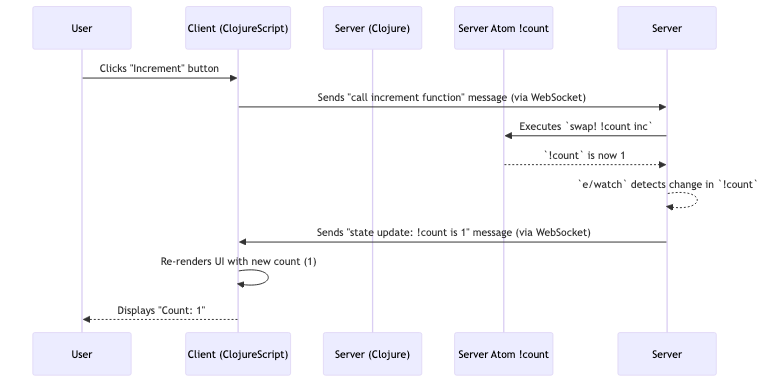

# Chapter 1: Electric DSL & Reactivity

Welcome to Electric! This chapter introduces the core of Electric: its Domain Specific Language (DSL) and reactivity model. This is how you'll build applications that seamlessly bridge the gap between server-side logic and client-side user interfaces.

## What's the Big Idea?

Imagine you're building a web application, say, a simple counter. You want a button in the browser that, when clicked, increments a number. Crucially, this number should be managed on the server, and any change to it should instantly reflect back in the browser for all connected users.

Traditionally, this involves:
1.  Writing JavaScript for the button click.
2.  Making an API call (e.g., REST or GraphQL) to the server.
3.  Writing server-side code to handle the API call and update the counter.
4.  Setting up a way (like WebSockets or polling) to push the updated count back to the client.
5.  Writing more JavaScript to receive this update and refresh the UI.

That's a lot of boilerplate and context-switching between client and server code! Electric aims to simplify this dramatically.

**Electric DSL & Reactivity** provides a way to write Clojure code that looks almost like regular Clojure, but with special "superpowers." Some parts of your function will run on the server, some in the browser, and Electric will automatically handle the communication and data synchronization over WebSockets.

## Key Concepts

Let's break down the magic:

1.  **Unified Codebase, Distributed Execution**: You write your application logic in `.cljc` files (Clojure and ClojureScript). Electric's macros then determine which parts run on the server (as Clojure) and which run on the client (as ClojureScript in the browser).

2.  **Electric Macros**: These are your main tools:
    *   `e/defn`: Defines an "Electric function." These are the building blocks of your reactive components.
    *   `e/fn`: Similar to Clojure's `fn`, but for creating anonymous Electric functions, often used for event handlers.
    *   `e/client`: A macro that wraps code intended to run *only* in the client's browser.
    *   `e/server`: A macro that wraps code intended to run *only* on the server.

3.  **Reactivity**: This is where Electric truly shines.
    *   `e/watch`: You can "watch" a Clojure atom (or other reactive sources). If the value of the atom changes on the server, any client code that depends on it (via `e/watch`) will automatically re-run and update the UI.
    *   `e/input`: A more general way to consume reactive data flows. `e/watch` is a convenient wrapper around `e/input` for atoms.

4.  **Seamless Communication**: Under the hood, Electric uses WebSockets to transfer data and function calls between the server and the client. You rarely need to think about this; Electric manages it based on how you structure your code with `e/client` and `e/server`.

## Building Our Counter: A Hands-On Example

Let's build that counter application.

First, we need a place to store our count on the server. A simple Clojure atom will do:

```clojure
;; src/user_main.cljc (or your main application namespace)
(ns user-main
  (:require [hyperfiddle.electric :as e]
            ;; We'll use DOM functions in a later chapter, for now, assume they exist
            [hyperfiddle.electric-dom2 :as dom]))

(def !count (atom 0)) ; Lives on the server
```
This `!count` atom is standard Clojure state, residing on the server.

Now, let's create an Electric component to display and interact with this counter:

```clojure
(e/defn Counter []
  (e/client ; This whole block runs in the browser
    (let [current-val (e/server (e/watch !count))] ; Fetch and watch server state
      (dom/div
        (dom/h1 (dom/text "Count: " current-val))
        (dom/button
          (dom/on "click" (e/fn [_event]
                            (e/server (swap! !count inc)))) ; Call server logic
          (dom/text "Increment"))))))
```

Let's break this `Counter` function down:
1.  `(e/defn Counter [] ...)`: We define an Electric function named `Counter`.
2.  `(e/client ...)`: Everything inside this block is designated to run on the client (in the browser).
3.  `(let [current-val (e/server (e/watch !count))] ...)`: This is a crucial line.
    *   `(e/server ...)`: The code inside this block runs on the server.
    *   `(e/watch !count)`: On the server, we watch the `!count` atom. This means whenever `!count` changes, Electric's reactivity system will be notified.
    *   The value of `(e/watch !count)` (the current count) is transferred from the server to the client and bound to `current-val`. Because it's `e/watch`, this binding is reactive: if `!count` changes on the server, `current-val` will update on the client, and the UI will re-render automatically.
4.  `(dom/div ...)` , `(dom/h1 ...)` , `(dom/button ...)` , `(dom/text ...)`: These are functions for [DOM Manipulation (electric-dom3)](04_dom_manipulation__electric_dom3_.md). For now, just know they create HTML elements.
5.  `(dom/on "click" (e/fn [_event] (e/server (swap! !count inc))))`:
    *   This sets up a click handler for the button.
    *   `(e/fn [_event] ...)`: Defines an anonymous Electric function for the handler.
    *   `(e/server (swap! !count inc))`: When the button is clicked (client-side event), this code *inside* `e/server` runs on the server. It increments the `!count` atom.

**What happens when you run this?**
*   The client displays "Count: 0".
*   You click the "Increment" button.
*   The `(swap! !count inc)` runs on the server. `!count` becomes 1.
*   The `(e/watch !count)` on the server detects this change.
*   Electric automatically sends the new value (1) to the client.
*   The client UI updates to "Count: 1".
*   All this happens without manual API calls or WebSocket message handling!

## Under the Hood: A Glimpse

How does Electric achieve this "magic"?

When your Electric application starts, both a server-side Clojure process and a client-side ClojureScript application (in the browser) are running. They establish a WebSocket connection managed by the [Electric Runtime](03_electric_runtime_.md).

Let's trace the counter example:



**Code Compilation and Macros:**

Electric's macros (`e/defn`, `e/client`, `e/server`) are more than just syntactic sugar. They are processed by the Electric compiler, which analyzes your code and transforms it.

*   `e/defn`: As seen in `src/hyperfiddle/electric3.cljc`, `e/defn` is a macro that ultimately calls `lang/->source`. This function in `src/hyperfiddle/electric/impl/lang3.clj` (for Clojure) and its ClojureScript counterpart are responsible for analyzing the Electric function body.

    ```clojure
    ;; src/hyperfiddle/electric3.cljc
    (defmacro defn [nm & fdecl]
      (let [;; ... elided setup ...
            env (merge (meta nm) (lang/normalize-env &env) web-config {::lang/def nm})
            source (lang/->source env (-> nm ns-qualify keyword)
                     (with-meta `(-fn ~nm2 ~@(cond-> fdecl (string? (first fdecl)) next))
                       (meta &form)))]
        ;; ... elided metadata management ...
        `(def ~nm2 ~source)))
    ```
    This macro prepares the environment and uses `lang/->source` to process the function body into a special structure that the Electric runtime can understand.

*   `e/client` and `e/server`: These macros mark sections of code for specific peers.
    ```clojure
    ;; src/hyperfiddle/electric3.cljc
    (defmacro client [& body] `(check-electric client (::lang/site :client ~@body)))
    (defmacro server [& body] `(check-electric server (::lang/site :server ~@body)))
    ```
    The `::lang/site` directive tells the compiler and runtime where this code should execute. The runtime ensures that when control flow hits an `e/server` block from client code, the execution "transfers" to the server, and vice-versa.

*   `e/watch`: This macro sets up a reactive subscription.
    ```clojure
    ;; src/hyperfiddle/electric3.cljc
    (defmacro watch "
    Syntax :
    ```clojure
    (watch !ref)
    ```
    Returns the current state of current reference `!ref`.
    " [ref] `(check-electric watch (input (m/watch ~ref))))
    ```
    It uses `m/watch` from the `missionary` library (a reactive streams library) and `e/input` to create a flow of values. The [Electric Runtime](03_electric_runtime_.md) ensures that changes in this flow are propagated across the network if the `e/watch` is in an `e/server` block and consumed in an `e/client` block.

The core idea is that your `e/defn` functions are compiled into a format that the [Electric Runtime](03_electric_runtime_.md) can execute, managing state synchronization and remote procedure calls transparently across the WebSocket connection.

## Analogy: The Smart Restaurant

Think of Electric DSL as a very smart restaurant ordering system:
*   You (the developer) write a single order slip (`e/defn`).
*   Some items on the slip are marked "for the kitchen" (`e/server` - e.g., "cook steak medium-rare").
*   Other items are "for the waiter at the table" (`e/client` - e.g., "pour water," "display current specials").
*   If a "special" changes in the kitchen (`e/watch` on a server atom), the waiter's tablet at every table automatically updates to show the new special.
*   If a customer orders more water via the tablet (client action calling `e/server` function), the kitchen gets the request, and the waiter is dispatched.

You, as the chef/manager, just write one cohesive plan, and the system figures out who does what and keeps everyone updated.

## Conclusion

You've now seen the heart of Electric: its DSL macros (`e/defn`, `e/client`, `e/server`) and the reactivity mechanism (`e/watch`). These tools allow you to write distributed applications with a unified codebase, where server-side logic and client-side UIs interact seamlessly and reactively. Electric handles the complex network communication, letting you focus on your application's logic.

This reactive data flow is often composed of sequences of changes. In the next chapter, we'll dive into a core data structure that powers much of this efficient, incremental reactivity: [Incremental Sequences (incseq)](02_incremental_sequences__incseq__.md).

---

Generated by [AI Codebase Knowledge Builder](https://github.com/The-Pocket/Tutorial-Codebase-Knowledge)