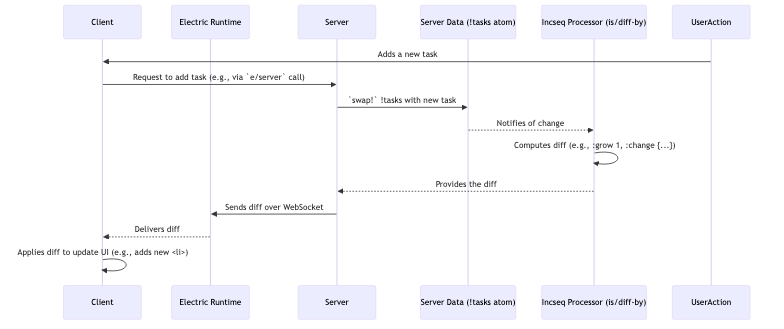

# Chapter 2: Incremental Sequences (incseq)

In [Chapter 1: Electric DSL & Reactivity](01_electric_dsl___reactivity_.md), we saw how Electric makes it easy to build reactive applications where server state changes are automatically reflected in the client UI. We used `e/watch` on a simple atom holding a number. But what happens when the data being watched is a large collection, like a list or a vector, and it changes frequently? Sending the entire collection over the network for every small change would be inefficient. This is where Incremental Sequences, or `incseq`, come into play.

## The Challenge: Efficiently Syncing Collections

Imagine you're building a collaborative to-do list application. Multiple users can add, remove, reorder, or edit tasks. This list of tasks might be stored on the server.

```clojure
;; Server-side state
(def !tasks (atom [{:id 1 :text "Buy milk"}
                   {:id 2 :text "Learn Electric"}]))
```

If we simply `(e/watch !tasks)` on the client, every time a task is added, removed, or even just its text changes, the entire list of tasks would be sent from the server to all connected clients. For small lists, this might be fine. But for long lists or frequent updates, this can lead to performance bottlenecks and high network traffic.

## Incremental Sequences: Git for Your Data

`incseq` is Electric's foundational reactive primitive for handling sequences that change over time. Instead of transmitting the entire collection on each update, `incseq` represents these changes as **diffs**. Think of it like Git: Git doesn't store a new copy of your entire project for every commit; it stores the changes (diffs) between versions. `incseq` does the same for your data sequences.

These diffs describe:
*   **Insertions**: New items added to the sequence.
*   **Deletions**: Items removed from the sequence.
*   **Moves**: Items changing their position in the sequence.
*   **Value Changes**: Existing items getting new values.

By sending only these compact diffs, Electric makes updates highly efficient, especially over the network.

## What's in a Diff?

A diff in `incseq` is a Clojure map that precisely describes the transformation from one state of a sequence to the next. Here are the key fields:

*   `:grow` (integer): The number of new "slots" to add to the end of the sequence.
*   `:degree` (integer): The size of the sequence *after* growing but *before* shrinking. This is the conceptual size during the transformation.
*   `:shrink` (integer): The number of "slots" to remove from the end of the sequence.
*   `:permutation` (map): Describes how items are rearranged. It's a map where keys are current indices and values are their new indices *before* any new items are considered from `:change`. For simple moves, it might look like `{old-idx new-idx, ...}`. For more complex rearrangements, it uses permutation mathematics as described in `hyperfiddle.incseq.perm-impl`.
*   `:change` (map): A map from an index to a new value, e.g., `{0 "New item A", 2 "Updated item C"}`.
*   `:freeze` (set): A set of indices whose values are considered "frozen" or final for this diff. (We'll mostly focus on the others for this introduction).

Let's say we have `[:a :b]` and it changes to `[:a :c :d]`.
A simplified diff might look something like:
*   No initial shrink.
*   Original items `[:a :b]`.
*   Grow by 1 to make space for `:d`. Sequence is conceptually `[:a :b nil]`.
*   Change `:b` at index 1 to `:c`. Sequence is `[:a :c nil]`.
*   Change `nil` at index 2 to `:d`. Sequence is `[:a :c :d]`.

The actual diff structure would be:
```clojure
{;; Assume original degree was 2
 :grow 1        ;; one new item added
 :degree 3      ;; new size
 :shrink 0      ;; no items removed from the end
 :permutation {} ;; no reordering in this simple case
 :change {1 :c,  ;; item at index 1 changed
          2 :d}  ;; new item at new index 2
 :freeze #{}}    ;; (can often be ignored for basic understanding)
```
This tells us the sequence grew by one, its new effective size is 3, nothing was shrunk from the end, no items were reordered, item at index 1 changed to `:c`, and a new item `:d` appeared at index 2.

## Creating an Incremental Sequence: `diff-by`

The `hyperfiddle.incseq` namespace (aliased as `is` or `inc`) provides functions to work with incremental sequences. A common way to create an `incseq` is from a `missionary` flow (a reactive stream) of collections using `is/diff-by`.

`is/diff-by` takes a key function (like `identity` or `:id`) and a flow of collections. It observes the flow and, whenever the collection changes, it computes a diff from the previous version of the collection to the new one. The output is a new flow, but this time, it's a flow of diffs – an incremental sequence!

```clojure
(require '[hyperfiddle.incseq :as is]
         '[missionary.core :as m])

;; Assume !my-data is an atom holding a collection, e.g., a vector of maps
(def !my-data (atom [{:id 1, :val "A"} {:id 2, :val "B"}]))

;; Create an incseq that produces diffs based on changes to !my-data,
;; using :id as the key to track items.
(def my-incseq (is/diff-by :id (m/watch !my-data)))
```
Now, `my-incseq` is a reactive flow. When `!my-data` changes, `my-incseq` will emit a diff object describing that change, not the entire new collection.

## Applying Diffs: `patch-vec`

To see the effect of a diff, you can use `is/patch-vec`. It takes a vector and a diff, and returns the new vector after applying the diff.

```clojure
(def initial-state [:a :b])
(def a-diff {:grow 1, :degree 3, :shrink 0,
             :permutation {}, :change {1 :x, 2 :c}})

(is/patch-vec initial-state a-diff)
;; => [:a :x :c]
```
This shows how `initial-state` `[:a :b]` is transformed into `[:a :x :c]` by `a-diff`.

## Our To-Do List Example with `incseq`

Let's revisit the to-do list. Instead of watching the raw `!tasks` atom directly on the client, the server can process it into an `incseq`.

**Server-Side:**
```clojure
;; src/user_main.cljc
(ns user-main
  (:require [hyperfiddle.electric :as e]
            [hyperfiddle.incseq :as is]
            [missionary.core :as m]
            [hyperfiddle.electric-dom2 :as dom])) ; For UI

(def !tasks (atom [{:id 1 :text "Buy milk" :done false}
                   {:id 2 :text "Learn Electric" :done false}]))

(e/defn TaskList []
  (let [task-diffs (e/server (is/diff-by :id (m/watch !tasks)))]
    ;; On the client, we'd consume these diffs to update the UI.
    ;; For now, let's imagine a function that takes diffs and renders.
    (e/client
      (dom/ul
        ;; In a real app, we'd use the diffs to incrementally update the DOM
        ;; For simplicity, here we'll just re-render from the latest full snapshot
        ;; (which Electric can derive by applying all diffs)
        (e/for [task (e/server (e/watch !tasks))] ; Still useful for initial render or simpler cases
          (dom/li (dom/text (:text task)))))))))

;; To demonstrate a change:
;; (swap! !tasks conj {:id 3 :text "Build an app" :done false})
;; This would generate a diff like:
;; {:grow 1, :degree 3, :shrink 0, :permutation {},
;;  :change {2 {:id 3, :text "Build an app", :done false}}, :freeze #{}}
```
When `!tasks` changes (e.g., a new task is added), `(is/diff-by :id (m/watch !tasks))` on the server computes a diff. This diff is then sent over the network to the client. The [Electric Runtime](03_electric_runtime_.md) and UI rendering logic (covered in [DOM Manipulation (electric-dom3)](04_dom_manipulation__electric_dom3_.md)) can use these diffs to make precise, minimal updates to the displayed list.

## Combining Diffs: `combine`

What if multiple changes happen rapidly, or we have a sequence of diffs? The `is/combine` function takes two or more diffs and produces a single diff that represents the cumulative effect. This is crucial for efficiently batching updates.

```clojure
;; From hyperfiddle.incseq.diff-impl.cljc (conceptual)
(defn combine [diff1 diff2]
  ;; ... complex logic to merge permutations, changes, etc. ...
  )
```
If `diff1` changes `[:a :b]` to `[:a :x :b]` and `diff2` changes `[:a :x :b]` to `[:x :b]`, then `(is/combine diff1 diff2)` would produce a single diff that transforms `[:a :b]` directly to `[:x :b]`.

## Operations on Incremental Sequences

`incseq`s are not just about sending diffs; they also support powerful operations:

*   `is/latest-product`: Combines multiple `incseq`s. If you have an `incseq` of users and an `incseq` of their selected themes, `latest-product` can create a new `incseq` representing users paired with their themes. Changes in either input `incseq` efficiently update the output.
*   `is/latest-concat`: Flattens an `incseq` of `incseq`s. Imagine a list of chat rooms, where each chat room itself is an `incseq` of messages. `latest-concat` can produce a single `incseq` of all messages from all rooms, updating efficiently as rooms are added/removed or messages arrive.

These operations work directly on the diffs, maintaining the efficiency of incremental updates throughout your data processing pipeline.

## Under the Hood: How Diffs Flow

Let's visualize the process when a collection watched via `incseq` changes:



**The Diff Data Structure & Logic:**
The core logic for diffs resides in `hyperfiddle.incseq.diff-impl.cljc`.

The `empty-diff` function shows the baseline for a diff:
```clojure
;; From: src/hyperfiddle/incseq/diff_impl.cljc
(defn empty-diff [n]
  {:degree n :grow 0 :shrink 0
   :permutation {} :change {} :freeze #{}})
```
This represents no change to a collection of size `n`.

The `combine` function (simplified concept):
```clojure
;; From: src/hyperfiddle/incseq/diff_impl.cljc
(defn combine [x y] ; x is older diff, y is newer diff
  (let [px (:permutation x), py (:permutation y)
        ;; ... many other variables for degrees, changes, freezes ...
        dx (:degree x), dy (:degree y)
        cx (:change x), cy (:change y)]

    ;; 1. Calculate the new overall degree.
    ;; 2. Compose permutations: (p/compose py px-adjusted-for-y's-context)
    ;;    This involves complex logic from `hyperfiddle.incseq.perm-impl.cljc`
    ;;    to correctly merge moves and reorders.
    ;; 3. Merge changes: Apply y's changes, then x's changes that
    ;;    haven't been superseded by y.
    ;; 4. Calculate final grow, shrink.
    ;; ...
    (comment {:degree new-degree, :permutation combined-p, ...})
    ))
```
The actual `combine` function is quite sophisticated, ensuring that permutations, growths, shrinks, and value changes are correctly merged to produce a minimal, accurate diff representing the net change from the state before `x` to the state after `y`.

**Permutations (`hyperfiddle.incseq.perm-impl.cljc`):**
This file handles the mathematics of reordering. For example, `rotation` describes moving an item from one index to another, shifting items in between.
```clojure
;; From: src/hyperfiddle/incseq/perm_impl.cljc
(defn rotation [i j] ; move item from i to j
  (case (compare i j)
    -1 (cycle (range i (inc j) +1)) ; e.g. i=0,j=2 -> (0 1 2)
    0 {}
    +1 (cycle (range i (dec j) -1)))) ; e.g. i=2,j=0 -> (2 1 0)
```
A `cycle` like `(0 1 2)` means item at 0 moves to 1, 1 to 2, and 2 to 0. These are fundamental building blocks for describing complex reorders.

## Why `incseq` Matters for Electric

Incremental sequences are a cornerstone of Electric's efficiency.
1.  **Network Performance**: Sending small diffs instead of large collections drastically reduces network bandwidth and latency. This is critical for responsive UIs, especially on slower connections.
2.  **Client-Side Performance**: Applying small diffs to the DOM (or other client-side data structures) is much faster than re-rendering entire lists from scratch. This leads to smoother animations and a more fluid user experience.
3.  **Scalability**: Efficient data transfer and client-side processing allow Electric applications to handle larger datasets and more frequent updates without bogging down.
4.  **Composable Reactivity**: Operations like `latest-product` and `latest-concat` allow complex reactive data flows to be built from `incseq`s, with efficiency maintained at each step.

While `e/watch` on an atom is simple and powerful (as seen in Chapter 1), when that atom contains a collection that needs to be synced efficiently, `incseq` (often via `is/diff-by` on the server-side `e/watch` result) is the tool to reach for.

## Conclusion

You've now learned about Incremental Sequences (`incseq`), Electric's powerful mechanism for efficiently managing collections that change over time. By representing changes as diffs, `incseq` minimizes network traffic and enables fast, precise updates to UIs. You've seen how diffs are structured, how to create `incseq`s using `diff-by`, and how operations like `combine` and `latest-product` work with these incremental updates.

Understanding `incseq` is key to building performant and scalable Electric applications that handle dynamic collections of data. These diffs are processed and managed by the [Electric Runtime](03_electric_runtime_.md), which we'll explore in the next chapter to understand how Electric orchestrates the communication between server and client.

---

Generated by [AI Codebase Knowledge Builder](https://github.com/The-Pocket/Tutorial-Codebase-Knowledge)