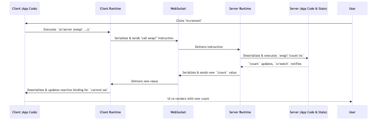

# Chapter 3: Electric Runtime

In [Chapter 2: Incremental Sequences (incseq)](02_incremental_sequences__incseq__.md), we explored how Electric efficiently manages changes in collections using `incseq` and diffs. But what orchestrates this complex dance of data synchronization, remote function calls, and state management between the client and server? That's the role of the Electric Runtime.

## The Engine Under the Hood

Imagine you're building our simple counter application from [Chapter 1: Electric DSL & Reactivity](01_electric_dsl___reactivity_.md). You wrote code that seemed to magically share state and call functions across the network.

```clojure
;; (Simplified from Chapter 1)
(def !count (atom 0)) ; Server-side state

(e/defn Counter []
  (e/client
    (let [current-val (e/server (e/watch !count))] ; Read server state
      ;; ... display current-val ...
      (dom/button
        (dom/on "click" (e/fn [_] (e/server (swap! !count inc)))) ; Call server logic
        (dom/text "Increment")))))
```
When a user clicks "Increment":
1.  A client-side event occurs.
2.  A server-side function `(swap! !count inc)` needs to be called.
3.  The server-side state `!count` changes.
4.  This change must be reflected back in `current-val` on the client.

The Electric Runtime is the invisible engine that makes all of this happen seamlessly. It's like the operating system for your Electric application, managing processes (your reactive `e/defn` scopes), memory (application state on both client and server), and networking (communication over WebSockets).

## Key Responsibilities of the Runtime

The Electric Runtime juggles several critical tasks:

1.  **State Management**: It keeps track of application state, whether that state "lives" on the server (like our `!count` atom) or on the client.
2.  **DSL Interpretation**: While the Electric macros ([Chapter 1: Electric DSL & Reactivity](01_electric_dsl___reactivity_.md)) transform your code at compile time, the runtime executes the resulting instructions, understanding where `e/server` and `e/client` blocks should run.
3.  **Network Communication**: This is a big one. The runtime:
    *   Establishes and manages the WebSocket connection between the client and server.
    *   Serializes data (and function calls) to send over the network.
    *   Deserializes data received from the network.
    *   Handles diffing (using `incseq` concepts from [Chapter 2: Incremental Sequences (incseq)](02_incremental_sequences__incseq__.md)) to send only necessary changes.
    *   Synchronizes state, ensuring consistency between peers.
4.  **Reactivity Orchestration**: It manages "ports" (communication channels for reactive values) and "frames" (scopes of execution for `e/defn`s). When a watched value changes, the runtime identifies dependent frames and ensures they re-evaluate, propagating changes correctly, even across the network.

Think of it as a highly sophisticated postal service combined with a personal assistant for your application. It knows where every piece of data and every function call needs to go, how to package it, and how to ensure the recipient understands it.

## How the Runtime Powers Our Counter

Let's trace the "Increment" button click with the Runtime in mind:

1.  **Client-Side Event**: User clicks the button. The `(e/fn ...)` event handler is triggered on the client.
2.  **Runtime on Client**: The client runtime encounters `(e/server (swap! !count inc))`. It recognizes `e/server` and knows this code must run on the server.
    *   It serializes the instruction (conceptually, "call `swap!` on `!count` with `inc`").
    *   It sends this serialized message to the server runtime via the WebSocket connection.
3.  **Runtime on Server**: The server runtime receives the message.
    *   It deserializes the instruction.
    *   It executes `(swap! !count inc)` in the server's Clojure environment. The `!count` atom is updated.
4.  **Reactive Propagation (Server)**: The server runtime knows that `!count` is being watched by `(e/watch !count)` within the `Counter` component's server-side context.
    *   It detects the change in `!count`.
    *   It determines that the new value of `!count` needs to be sent to the client (because `current-val` on the client depends on it).
    *   It serializes the new value of `!count`.
5.  **Runtime on Server (Sending)**: Sends the serialized new value back to the client runtime over WebSockets.
6.  **Runtime on Client (Receiving)**: The client runtime receives the new value.
    *   It deserializes it.
    *   It updates its internal representation of `current-val`.
    *   Because `current-val` is reactive, the runtime triggers a re-render of the parts of the UI that depend on `current-val`. The display updates.

All this complex interaction is managed transparently by the Electric Runtime.

## A Glimpse Under the Hood: The Runtime's Machinery

The Electric Runtime is a sophisticated piece of engineering. While you don't usually interact with it directly, understanding its main components can be helpful.



**Key Code Modules:**

*   **Core Runtime Logic (`hyperfiddle.electric.impl.runtime3.cljc`)**: This is the heart of the runtime, shared between Clojure (server) and ClojureScript (client).
    *   `make-peer`: Initializes a runtime instance (peer) for either client or server. It sets up structures for managing state, remotes, and definitions.
        ```clojure
        ;; Conceptual, from runtime3.cljc
        (defn make-peer [site opts subject defs main args]
          (let [peer (object-array peer-slots) ; Holds peer state
                remote (object-array remote-slots)] ; Holds remote connection state
            ;; ... initialize peer with site, defs ...
            ;; ... initialize remote with peer link, inputs/outputs maps ...
            (aset peer peer-slot-root ; The main e/defn to run
              (make-frame peer nil 0 :client (apply dispatch "<root>" ((defs main)) (map pure args))))
            ;; ... setup event handling for WebSocket messages ...
            peer))
        ```
        This function sets up the internal data structures ("slots" and "frames") that track the state and dependencies of your Electric application.
    *   `channel-transfer`: Handles sending data (diffs, requests) over the network channel. It packages messages for transit.
    *   `port-*`, `frame-*`, `slot-*` functions: Manage the reactive graph of dependencies. "Ports" are like connection points for reactive data flows, and "frames" are execution contexts for `e/defn` components.

*   **Client-Side Connection (`hyperfiddle.electric_client3.cljs`)**: Manages the WebSocket connection from the browser.
    *   `connect`: Establishes the WebSocket connection to the server.
        ```clojurescript
        ;; Conceptual, from electric_client3.cljs
        (defn connect [url]
          (fn [s f] ; Missionary flow subscriber
            (let [ws (new js/WebSocket url)]
              (set! (.-onopen ws) (fn [_] (s ws))) ; Success
              (set! (.-onclose ws) (fn [_] (s nil))) ; End or failure
              #(.close ws)))) ; Teardown
        ```
        This function initiates the WebSocket handshake. The actual connection logic is more robust, handling retries, as seen in `connector`. This is part of what the [Client Connection](08_client_connection_.md) chapter will detail.
    *   `send-all`: Sends messages from the client to the server over the WebSocket.

*   **Server-Side WebSocket Handling (`hyperfiddle.electric_ring_adapter3.clj`)**: Integrates Electric with Ring-compatible web servers (like Jetty, http-kit) to handle WebSocket connections. This is a key part of [Websocket Adapters](09_websocket_adapters_.md).
    *   `wrap-electric-websocket`: A Ring middleware that upgrades HTTP requests to WebSockets and bootstraps the Electric server runtime for that connection.
        ```clojure
        ;; Conceptual, from electric_ring_adapter3.clj
        (defn wrap-electric-websocket [next-handler entrypoint-fn]
          (fn [ring-request]
            (if (ws/upgrade-request? ring-request) ; Check if it's a WebSocket upgrade
              (ring-ws-handler ring-request entrypoint-fn) ; Handle WebSocket
              (next-handler ring-request)))) ; Pass to next Ring handler
        ```
    *   `electric-ws-handler`: Sets up handlers for WebSocket events (`:on-open`, `:on-message`, `:on-close`). When a message arrives from the client, it's fed into the server-side Electric Runtime.
        ```clojure
        ;; Conceptual, from electric_ring_adapter3.clj
        (defn electric-ws-handler [ring-req boot-fn]
          {;; ... other handlers ...
           :on-message (fn [_socket msg-payload]
                         ;; ... keepalive logic ...
                         (let [handler (aget state on-message-slot)] ; Get runtime's message handler
                           (handler msg-payload)))}) ; Pass message to runtime
        ```
        When a message (like "call swap!") arrives, `on-message` passes it to the runtime machinery, which then acts upon it.

**Serialization and Deserialization:**
The runtime uses Cognitect's `transit` library to serialize Clojure/Script data structures (including special Electric runtime types like `Slot` and `Frame` references) into a format (usually JSON) that can be sent over WebSockets and then deserialize them on the other end. This is configured in `runtime3.cljc` within `channel-writer-opts` and `channel-reader-opts`.

```clojure
;; Conceptual snippet from runtime3.cljc for writer options
(defn channel-writer-opts [opts ^objects channel]
  {;; ...
   :handlers {Slot (t/write-handler (fn [_] "slot") (fn [^Slot slot] [(.-frame slot) (.-id slot)]))
              ;; ... other Electric-specific types ...
              }})
```
This allows the runtime to send not just simple data, but also references to parts of the reactive graph across the wire.

## Analogy: The Application's Operating System

As mentioned, the Electric Runtime is like an OS for your Electric application:
*   **Process Management**: Each active `e/defn` can be thought of as a reactive process. The runtime schedules their execution and re-execution based on data changes.
*   **Memory Management**: It manages the state (`atom`s, `incseq` data) on both client and server, ensuring consistency.
*   **Networking Stack**: It provides the transparent networking layer over WebSockets, handling all the low-level details of sending, receiving, serializing, and synchronizing.
*   **Interrupt Handling**: Client events (like clicks) or server-side data changes act like interrupts that the runtime handles to trigger appropriate actions.

You write your application logic using the Electric DSL, and the Runtime takes care of making it all work in a distributed, reactive way.

## Conclusion

The Electric Runtime is the powerful, yet mostly invisible, engine that drives your Electric applications. It bridges the client and server, manages state and reactivity, and handles all network communication, allowing you to focus on writing unified Clojure code. It interprets the Electric DSL, tracks dependencies through "ports" and "frames," and ensures changes propagate efficiently using mechanisms like those in `incseq`.

While you typically don't write code that interacts directly with the runtime's internal APIs, understanding its role is crucial for grasping how Electric achieves its "magic." It's the foundation upon which seamless client-server interaction is built.

With the runtime managing the "how," we can now turn our attention to more specific aspects of building UIs. In the next chapter, we'll explore how Electric interacts with the browser's Document Object Model for [DOM Manipulation (electric-dom3)](04_dom_manipulation__electric_dom3_.md).

---

Generated by [AI Codebase Knowledge Builder](https://github.com/The-Pocket/Tutorial-Codebase-Knowledge)