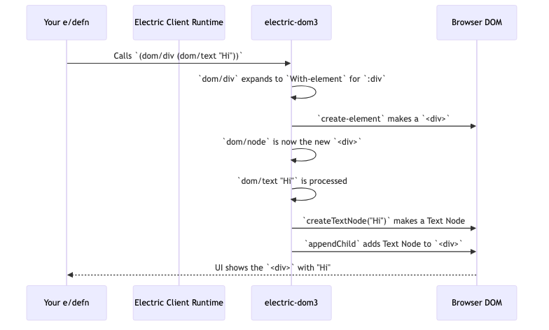
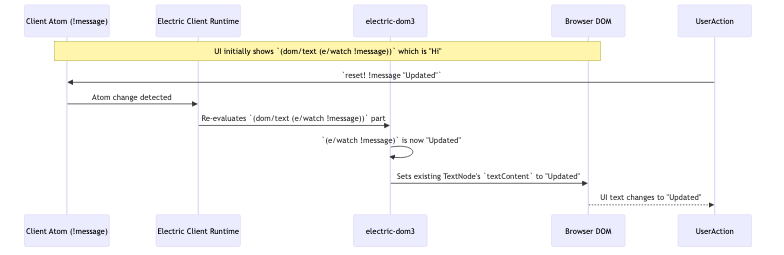

# Chapter 4: DOM Manipulation (`electric-dom3`)

In [Chapter 3: Electric Runtime](03_electric_runtime_.md), we saw how the Electric Runtime orchestrates data flow, remote calls, and state synchronization. It's the engine that makes Electric applications work. Now, let's turn our attention to what the user actually sees and interacts with: the User Interface. `electric-dom3` is Electric's library for building these UIs by creating and manipulating the HTML Document Object Model (DOM).

## Building Blocks for Your UI

Imagine you're building a house. You need bricks, windows, doors, and a way to put them together. In web development, the "house" is your application's interface, and the "bricks" are HTML elements like `<div>`s, `<button>`s, and `<p>`aragraphs. `electric-dom3` provides you with these building blocks and the tools to assemble them dynamically.

The core idea is to define your UI structure using Electric functions, and `electric-dom3` macros will translate that into actual HTML elements in the browser. Because this is Electric, these UI definitions can be reactive: when your application's state changes, the UI updates automatically.

Let's say we want to create a simple interactive message display: a heading that shows a message and a button to change that message and its color.

## Key Concepts & Usage

`electric-dom3` runs on the client-side. DOM manipulation happens in the browser, so you'll typically wrap your UI code in `(e/client ...)` or define `e/defn` components that are themselves designated to run on the client.

### 1. Creating Elements: `dom/div`, `dom/text`, etc.

`electric-dom3` provides macros for all standard HTML elements. For example, `(dom/div ...)`, `(dom/p ...)`, `(dom/button ...)`. These macros create the respective HTML elements.
Text content is created using `(dom/text "your string here")`.

```clojure
(e/client
  (dom/div ; Creates a <div> element
    (dom/h1 (dom/text "Welcome!")) ; Creates <h1> with "Welcome!" text inside
    (dom/p (dom/text "This is an Electric app.")))) ; Creates <p> with text
```
This code will render the following HTML structure in the browser:
```html
<div>
  <h1>Welcome!</h1>
  <p>This is an Electric app.</p>
</div>
```
Each `dom/*` element macro implicitly knows its parent (the `dom/node` it's nested within) and attaches the new element as a child.

### 2. Setting Attributes and Styles: `dom/props`

HTML elements often need attributes (like `id`, `class`) or inline styles. The `(dom/props <map>)` macro handles this.

```clojure
(e/client
  (dom/div
    (dom/props {:id "main-container"
                :class "app-view"
                :style {:background-color "lightblue"
                        :padding "20px"}})
    (dom/text "Styled content.")))
```
This creates a `div` with the specified ID, class, and inline styles. The `electric-dom3-props.cljc` file contains the logic for efficiently applying these.

**Reactivity in Props**: The real power comes when `dom/props` are reactive. If the map you provide to `dom/props` is derived from a reactive source (e.g., an `e/watch` on an atom), the DOM will update automatically when the source changes.

```clojure
(e/client
  (let [!is-active (atom false)
        active-class (if (e/watch !is-active) "active" "inactive")]
    (dom/button
      (dom/props {:class active-class})
      (dom/on "click" (e/fn [_] (swap! !is-active not)))
      (dom/text "Toggle Active"))))
```
Here, clicking the button changes `!is-active`. This causes `active-class` to re-evaluate, and `dom/props` updates the button's class attribute in the DOM.

### 3. Handling Events: `dom/on`

Interactive UIs need to respond to user actions like clicks, mouse movements, or keyboard input. `(dom/on "event-name" (e/fn [event] ...))` attaches an event listener to an element.

```clojure
(e/client
  (let [!counter (atom 0)]
    (dom/div
      (dom/p (dom/text "Count: " (e/watch !counter)))
      (dom/button
        (dom/on "click" (e/fn [_event]
                          (swap! !counter inc))) ; Increment client-side atom
        (dom/text "Increment")))))
```
When the button is clicked, the `e/fn` is executed. Since `!counter` is updated, the `dom/text` displaying the count automatically re-renders with the new value. Event handling logic is primarily in `electric-dom3-events.cljc`.

### Our Interactive Message Example

Let's build that interactive message display:

```clojure
;; Presume this is inside an e/defn or an e/client block
(let [!msg (atom "Hello Electric!") ; Client-side state
      !color (atom "blue")]        ; Client-side state for color
  (dom/div
    (dom/props {:style {:border "1px solid black" :padding "10px"}}) ; Static props

    (dom/h1 (dom/props {:style {:color (e/watch !color)}}) ; Reactive style
            (dom/text (e/watch !msg)))                     ; Reactive text

    (dom/button
      (dom/on "click" (e/fn [_]
                        (swap! !msg #(if (= % "Hello Electric!") "Clicked!" "Hello Electric!"))
                        (swap! !color #(if (= % "blue") "red" "blue"))))
      (dom/text "Toggle Message & Color"))))
```
When you run this:
1.  A `div` appears with a border and padding.
2.  Inside, an `h1` shows "Hello Electric!" in blue.
3.  A button says "Toggle Message & Color".
4.  Clicking the button:
    *   The `!msg` atom changes, so the `h1` text updates to "Clicked!".
    *   The `!color` atom changes, so the `h1` text color updates to red.
    *   Click again, and they toggle back.

This demonstrates how `dom/text`, `dom/props`, and `dom/on` work together with Electric's reactivity to create dynamic UIs.

## Under the Hood: How `electric-dom3` Works

When you use a macro like `(dom/div ...)`, it expands into code that interacts with the browser's DOM.

1.  **Element Creation**:
    *   Macros like `dom/div` typically expand to use `dom/element*`, which then calls an `e/defn` named `dom/With-element`.
    *   `dom/With-element` is responsible for creating the actual DOM element (e.g., `document.createElement("div")`) in the browser. It also establishes a new `dom/node` binding, so child elements know their parent.

    ```clojure
    ;; Conceptual structure from electric-dom3.cljc
    (e/defn With-element [ns tag Body]
      (let [mount-point (e/client (e/mount-point)) ; For managing children efficiently
            element (e/client (create-element ns tag mount-point))] ; JS interop to make the DOM node
        (r/do! ; Ensure execution order
          (e/client
            ;; Attach this new element to its parent in the DOM tree
            (e/input (attach! dom/node (e/tag) element))
            ;; Listen to changes in children and update DOM
            (e/input (m/reductions mount-items element mount-point))
            nil)
          (binding [dom/node element] ; Children will be parented to this 'element'
            (Body))))) ; Execute child elements' code
    ```
    The `create-element` function (not shown) uses JavaScript's `document.createElementNS` or `document.createElement`.

2.  **Managing Children (Connecting to `incseq`)**:
    *   Each element created with `dom/With-element` gets its own `mount-point`. This is a concept from `hyperfiddle.kvs` which is related to [Incremental Sequences (incseq)](02_incremental_sequences__incseq__.md).
    *   When you define children inside a `(dom/div ...)`, each child (e.g., a `dom/text` or another `dom/div`) registers itself with the parent's `mount-point` using `attach!`.
    *   The line `(m/reductions mount-items element mount-point)` sets up a reactive process. `mount-items` listens to the `mount-point` (which behaves like an `incseq` of child elements). When children are added, removed, or reordered, `mount-items` receives a diff and uses efficient DOM operations (`appendChild`, `removeChild`, `insertBefore`, `replaceChild`) to update the actual browser DOM. The `patch-nodelist` function in `electric-dom3.cljc` contains the detailed logic for applying these diffs to a list of DOM nodes.

3.  **Props and Events**:
    *   `dom/props` ultimately calls `Property` (from `electric-dom3-props.cljc`) for each key-value pair. `Property` then intelligently decides whether to set an HTML attribute, a DOM object property, or manage classes/styles. For styles, it delegates to `css/Style` (from `electric-css3`).
    *   `dom/on` uses helper functions from `electric-dom3-events.cljc` like `listen` to create a Missionary flow from browser events. Electric then consumes this flow.

Here's a simplified view of creating an element and its text:



And when reactive data changes:



Essentially, `electric-dom3` acts as a bridge, translating your Electric UI definitions into live, reactive browser elements. It uses the efficiency of [Incremental Sequences (incseq)](02_incremental_sequences__incseq__.md) under the hood to make list updates fast.

You can also create SVG elements using `hyperfiddle.electric-svg3`, which provides similar macros like `svg/svg`, `svg/circle` that build upon `electric-dom3` by specifying the SVG namespace.

## Analogy: Lego Bricks for Web Interfaces

Think of `electric-dom3` as your box of Lego bricks.
*   `dom/div`, `dom/p`, `dom/button` are different types of bricks (a 2x4, a 1x2, a special interactive piece).
*   `(dom/text "...")` is like putting a sticker or label on a brick.
*   `(dom/props {:style {:color "red"}})` is like choosing a red brick or adding a specific feature.
*   `(dom/on "click" ...)` makes a brick do something when you press it.
*   Electric's reactivity ensures that if you decide your "model" needs a blue brick instead of red, your Lego construction automatically updates to use a blue brick.

You compose these bricks together within your `e/defn` components to build up your entire user interface.

## Conclusion

`electric-dom3` provides the fundamental tools for creating and manipulating the DOM within Electric applications. By offering macros like `dom/div` for element creation, `dom/props` for reactive attribute and style setting, and `dom/on` for event handling, it allows you to build user interfaces in a declarative and reactive way. Changes in your application state, whether on the client or server, seamlessly reflect in the UI managed by `electric-dom3`.

With these building blocks for general UI, we often need more specialized components for user input. In the next chapter, we'll explore [Forms (electric-forms5)](05_forms__electric_forms5_.md), which builds upon `electric-dom3` to simplify creating and managing forms.

---

Generated by [AI Codebase Knowledge Builder](https://github.com/The-Pocket/Tutorial-Codebase-Knowledge)