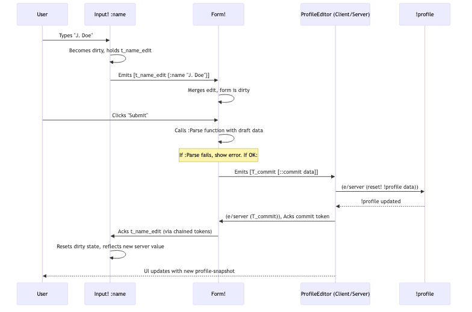

# Chapter 5: Forms (`electric-forms5`)

In [Chapter 4: DOM Manipulation (electric-dom3)](04_dom_manipulation__electric_dom3_.md), we learned how to build basic UIs with `electric-dom3`. While powerful, directly managing the state of many input fields, handling validation, tracking changes, and coordinating submissions can become complex. This is where `electric-forms5` comes in, offering a higher-level toolkit specifically for building robust user input forms.

## The Challenge: Taming User Input

Imagine you need to create a "User Profile" page where users can edit their name, email, and newsletter subscription preferences. You'd need to:
1.  Display the current profile data in input fields.
2.  Let the user type into these fields.
3.  Keep track of what has changed (is the form "dirty"?).
4.  Validate the input (e.g., is the email valid? Is the name non-empty?).
5.  Provide "Submit" and "Discard" buttons.
6.  On submit, send valid data to the server.
7.  On discard, revert to the original data.
8.  Ensure this all works smoothly with Electric's reactive, transactional model.

`electric-forms5` provides components like `Input!`, `Checkbox!`, and `Form!` that handle much of this complexity for you. It's like a specialized UI kit focused on data entry, built on top of `electric-dom3` and deeply integrated with Electric's concept of [Tokens](07_tokens_.md) for managing transactions.

## Key Concepts

Let's break down how `electric-forms5` simplifies form creation:

1.  **Transactional Inputs (`Input!`, `Checkbox!`, etc.)**:
    *   These are the core input elements. When a user interacts with `Input! :name "current-name"`, it doesn't immediately try to change `"current-name"` on the server.
    *   Instead, it displays the user's typing locally and creates a "pending edit" – a [Token](07_tokens_.md) paired with the proposed change (e.g., `[<token> {:name "new-name"}]`).
    *   This keeps the UI responsive and allows changes to be batched or discarded.
    *   They also visually indicate their state (e.g., focused, busy/waiting for commit, error).

2.  **The `Form!` Container**:
    *   `Form!` is the orchestrator. You wrap your transactional inputs within a `Form!`.
    *   It takes the initial, authoritative data (e.g., fetched from the server).
    *   It collects all pending edits from its child inputs.
    *   It manages the overall "dirty" state of the form.
    *   It handles the submission and discard logic.

3.  **Submission and Discard (`SubmitButton!`, `DiscardButton!`)**:
    *   `Form!` can often provide default submit/discard buttons.
    *   When "Submit" is clicked, `Form!` takes all collected pending edits, potentially validates the combined data, and then emits a single "commit" command (itself a [Token](07_tokens_.md) wrapping the data to be committed).
    *   When "Discard" is clicked, `Form!` tells all child inputs to abandon their pending edits, and the form reverts to the last known authoritative state.

4.  **Validation**:
    *   `Form!` allows you to specify a `:Parse` function. This function is called before submission with the collected form data. You can perform validation here and `throw` an `ex-info` if the data is invalid. The form will display the error and prevent submission.
    *   Individual inputs like `Input!` can also use a `:Parse` prop for field-level parsing/validation as the user types, setting `aria-invalid` and custom validity messages.

5.  **Controlled Nature**:
    *   These forms are "controlled" in the sense that their state changes are managed transactionally through tokens. The underlying data source (e.g., a server-side atom) is only updated after a successful commit.

## Building Our User Profile Form

Let's build the "User Profile" form. First, we need a place on the server to store the profile data:

```clojure
;; src/user_main.cljc (or your main application namespace)
(ns user-main
  (:require [hyperfiddle.electric :as e]
            [hyperfiddle.electric-dom3 :as dom]
            [hyperfiddle.electric-forms5 :as forms]))

;; Server-side atom to store the profile
(def !profile (atom {:name "Jane Doe",
                     :email "jane@example.com",
                     :subscribed? true}))
```
This `!profile` atom lives on the server and holds the authoritative data.

Now, let's create the UI component for the form:

```clojure
(e/defn ProfileEditor []
  (e/client
    ;; 1. Watch the authoritative profile data from the server
    (let [profile-snapshot (e/server (e/watch !profile))

          ;; 2. Create the Form! It returns a flow of commands.
          form-output (forms/Form! profile-snapshot ; Initial data for the form
                        ;; This function renders the form's content.
                        ;; `p` is the current "draft" state of the form.
                        (e/fn [p]
                          (dom/div
                            (dom/label (dom/text "Name: "))
                            (forms/Input! :name (:name p))) ; Transactional text input
                          (dom/div
                            (dom/label (dom/text "Email: "))
                            (forms/Input! :email (:email p) :type "email"))
                          (dom/div
                            (forms/Checkbox! :subscribed? (:subscribed? p)
                              :label "Subscribe to newsletter?"))) ; Transactional checkbox

                        ;; Options for Form!
                        :show-buttons true ; Automatically add Submit & Discard buttons
                        ;; :Unparse maps authoritative data to form's internal model
                        :Unparse (e/fn [server-val] [nil server-val]) ; [command-type, data-for-form]
                        ;; :Parse validates/transforms data on submit
                        :Parse (e/fn [form-val _tempid]
                                 (if (empty? (:name form-val))
                                   (throw (ex-info "Name is required!" {:field :name}))
                                   form-val)))]

      ;; 3. Handle commands emitted by the Form!
      (e/for-by first [[token [command-type data] :as _full-command] form-output]
        ;; `token` is the key for e/for-by, ensuring each command is processed once.
        (e/server
          (case command-type
            ::forms/commit   (do (println "Server: Committing data" data)
                                 (reset! !profile data) ; Update server state
                                 (token)) ; Acknowledge the token
            ::forms/discard  (do (println "Server: Discarding changes")
                                 (token)) ; Acknowledge discard
            (do (println "Server: Unknown form command" command-type)
                (token ::unknown-command)))))))) ; Acknowledge with error
```

Let's break down `ProfileEditor`:
1.  `(e/server (e/watch !profile))`: Fetches the current profile from the server and keeps `profile-snapshot` updated if `!profile` changes elsewhere.
2.  `(forms/Form! ...)`: Initializes the form.
    *   `profile-snapshot`: The starting data.
    *   `(e/fn [p] ...)`: This function defines the UI of your form. `p` is a map like `{:name "Jane Doe", ...}` representing the current *draft* values in the form fields. You use `forms/Input!` and `forms/Checkbox!` here, passing them the field keyword (e.g., `:name`) and the current draft value for that field (e.g., `(:name p)`).
    *   `:show-buttons true`: Tells `Form!` to render default "Submit" and "Discard" buttons.
    *   `:Unparse`: A function that `Form!` uses to understand how to populate its internal draft state from the `profile-snapshot` or after a command. `[nil server-val]` means "no specific command, just use this data for the form fields."
    *   `:Parse`: A function called when the user clicks "Submit". It receives the collected draft data from all inputs. Here, we check if the name is empty and `throw` an exception if it is. This exception message will be displayed by the form. If valid, it returns the data.
3.  `(e/for-by first [[token [command-type data] ...] form-output] ...)`:
    *   `form-output` is a reactive flow of commands from the `Form!`. A command looks like `[<token> [::forms/commit {:name "New Name", ...}]]`.
    *   `e/for-by` processes each command.
    *   Inside the `e/server` block, we `case` on `command-type`:
        *   `::forms/commit`: We `reset!` the server-side `!profile` atom with the new `data`. Then, importantly, we call `(token)` to acknowledge the commit. This tells `Form!` and its inputs that the transaction was successful.
        *   `::forms/discard`: We simply `(token)` to acknowledge.
        *   The acknowledgement `(token)` (or `(token some-error)`) is crucial for `electric-forms5` to finalize the transaction and reset input states (e.g., clear "dirty" flags).

When you run this:
*   The form displays with "Jane Doe", "jane@example.com", and the checkbox checked.
*   If you change the name, the `Input!` for `:name` becomes "dirty." The overall `Form!` is now dirty.
*   If you try to submit with an empty name, an error message "Name is required!" appears.
*   If you submit valid data, the `::forms/commit` command is processed, `!profile` on the server updates, and the form returns to a non-dirty state, reflecting the newly saved data.
*   If you click "Discard", any changes you made are reverted, and the form shows `profile-snapshot` again.

## Under the Hood: The Transactional Dance

How does `electric-forms5` manage this?

1.  **User Input**: You type into an `(forms/Input! :name (:name p))`.
    *   The `Input!` component (defined in `electric-forms5.cljc`) uses `(dom/On* "input" ...)` to capture raw input.
    *   It uses `(e/Token ...)` to create a unique [Token](07_tokens_.md) for this pending edit.
    *   It displays your typed text immediately (respecting focus via `dom/Focused?` to avoid clobbering user input).
    *   It makes itself "dirty" and possibly "busy" (`aria-busy`).
    *   It emits a value like `[<token-for-name-edit> {:name "New typed name"}]`.

2.  **Form Collection**: `Form!` receives these edits.
    *   The `Form!*` internal implementation (called by `Form!`) uses `MergeEdits`.
    *   `MergeEdits` combines all active edits from child inputs into a single token and a merged map of changes: `[<combined-input-token> {:name "New typed name", :subscribed? false, ...}]`. This represents the current "dirty" state of the form.

3.  **Submission**: You click the "Submit" button (likely a `SubmitButton!`).
    *   `SubmitButton!` generates its own "submit" event token.
    *   `FormActions!` (an internal part of `Form!`) coordinates this.
    *   `Form!` calls your `:Parse` function with the merged data (e.g., `{:name "New typed name", :subscribed? false}`).
    *   If `:Parse` succeeds, `FormActions!` creates a final "commit" command. This involves creating a new master [Token](07_tokens_.md) (`T_commit`) that chains the `combined-input-token` and the "submit" event token.
    *   `Form!` emits `[T_commit [::forms/commit <parsed-data>]]`.

4.  **Server Processing & Acknowledgement**:
    *   Your `e/for-by` loop's `(e/server ...)` block gets this command.
    *   You update your database/atom (`reset! !profile data`).
    *   You call `(T_commit)`. This acknowledgement flows back.
    *   `FormActions!` receives this ack. It, in turn, acks the `combined-input-token`.
    *   Each original `Input!` (like the one for `:name`) receives the acknowledgement for its specific part of the `combined-input-token`.
    *   The `Input!` then resets its dirty/busy state and reflects the new authoritative value from `profile-snapshot` (which updated due to `(e/watch !profile)`).

Here's a simplified sequence:


**Key Code Glimpses from `electric-forms5.cljc`**:

*   `Input!`:
    ```clojure
    (e/defn Input! [field-name v & {:keys [Parse Unparse] ...}]
      (e/client
        ;; ...
        (let [e (dom/On* "input" identity nil) [t err] (e/Token e) ; Capture input, get token
              editing? (dom/Focused?)
              waiting? (some? t) ; Is there a pending token?
              ;; ... logic to determine unparsed-v (user input or server v) ...
              parsed-v (Parse (subs unparsed-v 0 maxlength))]
          (SetValidity parsed-v) ; HTML5 validation API
          (when-not dirty? (set! (.-value dom/node) unparsed-v)) ; Display value
          (e/When waiting? [t {field-name parsed-v}]) ; Emit edit
          )))
    ```
    This shows how `Input!` uses `e/Token` for its edits and `SetValidity` for validation feedback.

*   `Form!*` (internals of `Form!`):
    ```clojure
    (e/defn Form!* [value Fields & {:keys [Parse Unparse] ...}]
      (e/client
        (let [;; ... setup, Unparse value ...
              edits (Fields unparsed-value) ; Call user's UI function
              [form-t form-v] (MergeEdits edits) ; Collect all pending edits
              ;; ... parse form-v using :Parse ...
             ]
          ;; ...
          (FormActions! [form-t parsed-form-v] ...) ; Handle submit/discard
          ;; ... display validation messages ...
          )))
    ```
    `MergeEdits` is crucial for collecting changes, and `FormActions!` drives the submit/discard lifecycle.

## Analogy: The Diligent Secretary

Think of `electric-forms5` and `Form!` as a highly organized secretary managing an important document (your application data):
*   **The Master Document**: This is your authoritative data, like `!profile` on the server.
*   **Drafting Pens**: `Input!`, `Checkbox!` are special pens. When you use them to mark a change on a *copy* of a document section, the pen itself remembers this change (it's "dirty") and attaches a little note (a [Token](07_tokens_.md)) to it.
*   **The Secretary (`Form!`)**:
    *   She gives you a working copy based on the master document (using `:Unparse`).
    *   She collects all your little "change notes" from the pens.
    *   She knows if any part of the document copy has pending changes.
*   **Review & Finalize ("Submit")**: When you say "submit," the secretary first reviews all your marked changes against company policy (your `:Parse` function).
    *   If there's an issue, she points it out, and you can't submit yet.
    *   If all is good, she bundles up all your change notes under one master "update request" note (`T_commit`) and sends it off for approval (to your `e/server` handler).
*   **Approval & Update**: If the update request is approved (your server logic calls `(T_commit)`), the secretary is informed. She then updates the master document. The special pens are also told their changes are now official, so they reset.
*   **Canceling ("Discard")**: If you say "discard," the secretary shreds all the pending change notes, and your working copy reverts to the master document's state.

This system ensures that the master document is always valid and changes are handled in an orderly, transactional way.

## Conclusion

`electric-forms5` significantly simplifies building robust forms in Electric applications. By providing transactional input components (`Input!`, `Checkbox!`, etc.) and an orchestrating `Form!` container, it handles common concerns like dirty state tracking, validation, and transactional submission/discard using Electric's [Tokens](07_tokens_.md). This allows you to focus more on your application's data and business logic rather than the intricacies of form state management.

While forms help us input data, often we need to structure how and where these (and other) UI components appear on the page. In the next chapter, we'll explore [Mount Points & Tags](06_mount_points___tags_.md)
, which are fundamental to how Electric manages the lifecycle and nesting of UI elements.

---

Generated by [AI Codebase Knowledge Builder](https://github.com/The-Pocket/Tutorial-Codebase-Knowledge)