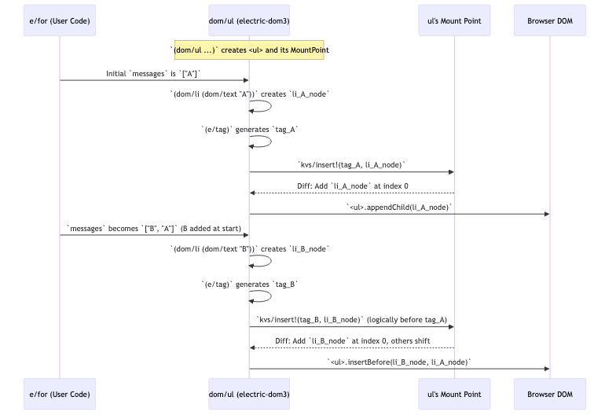

# Chapter 6: Mount Points & Tags

In [Chapter 5: Forms (electric-forms5)](05_forms__electric_forms5_.md), we saw how `electric-forms5` simplifies building complex, transactional forms. Underlying much of Electric's dynamic UI rendering, especially for collections of elements, is a powerful mechanism: Mount Points and Tags. This chapter explores these internal concepts, which are key to how Electric efficiently updates the DOM.

## The Challenge: Keeping Dynamic Lists Efficient

Imagine you're displaying a list of messages in a chat application. New messages arrive, old ones might be deleted, or perhaps messages can be reordered.

```clojure
(e/defn ChatMessages [messages]
  (e/client
    (dom/ul
      (e/for [msg messages] ; `messages` is a reactive list
        (dom/li (dom/text (:text msg)))))))
```

If `messages` is a long list, and a single new message arrives, simply re-rendering the entire `<ul>` and all its `<li>` children from scratch would be very inefficient. This could lead to sluggish UIs and unnecessary work for the browser. We need a smarter way to update only what has changed.

## The Electric Solution: Efficient Updates with `e/for`

Electric's `e/for` macro, when used with [DOM Manipulation (electric-dom3)](04_dom_manipulation__electric_dom3_.md) elements, is designed to handle these dynamic collections efficiently. When the `messages` list in our example changes, Electric doesn't redraw everything. Instead, it intelligently adds, removes, or reorders only the necessary `<li>` elements.

How does it achieve this? This is where Mount Points and Tags come into play.

## Introducing Mount Points & Tags: The Stage Metaphor

Think of a dynamic part of your UI, like the `<ul>` in our chat example, as a **stage**. The child elements, like the `<li>` messages, are **actors** on this stage.
*   A **Mount Point** is like a **stage manager** for that specific stage (the `<ul>`). It's a container responsible for keeping track of all actors currently on stage.
*   **Tags** are like unique **ID badges** for each actor. The stage manager uses these IDs to know exactly who is who.

When the script for the play changes (i.e., your data collection updates):
*   If a new actor needs to appear, the director tells the stage manager, "Bring actor with ID 'msg-123' onto the stage."
*   If an actor needs to leave, "Actor 'msg-007' exits."
*   If actors need to change their order, "Actor 'msg-101' now comes before 'msg-008'."

The stage manager (Mount Point) uses these precise instructions, based on actor IDs (Tags), to update the stage (the DOM) with minimal disruption. Everything else on stage that didn't change stays put.

### Tags: Unique Identifiers
A Tag, in Electric, is a unique identifier for a child element within its parent. These are often generated automatically when using constructs like `e/for`. The `(e/tag)` macro is the underlying mechanism for creating these unique identifiers.

```clojure
;; Conceptual - you don't usually call this directly for DOM
;; (e/tag) ; generates a new, unique tag in the current reactive scope
```
Tags ensure that Electric can distinguish between different child elements, even if they look similar. For `e/for-by`, the key you provide helps create stable tags.

### Mount Points: Dynamic Child Managers
A Mount Point is an internal data structure, typically associated with a parent DOM element (like a `<div>` or `<ul>`) that can have a dynamic set of children. It's created using `(e/mount-point)`. This mount point acts as a key-value store where keys are tags and values are the child elements (or information about them).

```clojure
;; Conceptual - used internally by electric-dom3
;; (e/mount-point) ; creates a new mount point
```
The crucial part is that a mount point can be observed as an [Incremental Sequence (incseq)](02_incremental_sequences__incseq__.md). This means that when children are added, removed, or reordered in the mount point, it produces a diff describing these changes, enabling highly efficient updates.

## How `electric-dom3` and `e/for` Use Them

You typically don't interact with `e/mount-point` or `e/tag` directly when building UIs. Instead, they are used internally by [DOM Manipulation (electric-dom3)](04_dom_manipulation__electric_dom3_.md) and macros like `e/for` (from [Electric DSL & Reactivity](01_electric_dsl___reactivity_.md)).

1.  **Parent Element Creation**: When you create a DOM element that can have children, like `(dom/ul ...)`, `electric-dom3` internally does something like this (simplified):
    *   Creates the actual `<ul>` DOM node for the browser.
    *   Creates a new `(e/mount-point)` and associates it with this `<ul>` node.

2.  **Rendering Children with `e/for`**: When `(e/for [msg messages] (dom/li ...))` executes inside this `<ul>`:
    *   For each `msg` in the `messages` collection, the body of `e/for` executes.
    *   The `(dom/li ...)` call creates an `<li>` DOM node.
    *   This `<li>` node is given a unique `(e/tag)`.
    *   `electric-dom3` then "inserts" this `<li>` node (along with its tag) into the parent `<ul>`'s mount point. This is done via a function like `attach!` which uses `kvs/insert!` (from `hyperfiddle.kvs.cljc`).

3.  **Reacting to Changes**:
    *   The parent `<ul>` (again, via `electric-dom3`'s internal logic) continuously observes its mount point. Remember, this mount point provides an [Incremental Sequence (incseq)](02_incremental_sequences__incseq__.md) of its children.
    *   When the `messages` list changes:
        *   **Item Added**: `e/for` processes the new item. A new `<li>` is created, gets a tag, and is inserted into the mount point. The mount point emits a diff: "grow by 1, change at new index N is this new `<li>`".
        *   **Item Removed**: `e/for` sees an item is gone. The corresponding `<li>` (identified by its tag) is removed from the mount point. The mount point emits a diff: "shrink by 1, remove item at old index M".
        *   **Items Reordered**: `e/for` (especially `e/for-by` with keys) figures out the new order. The mount point is updated, emitting a diff with permutations: "item at index P moves to Q".
    *   `electric-dom3` takes these diffs from the mount point and uses efficient DOM operations (`appendChild`, `removeChild`, `insertBefore`, etc.) to update the *actual* browser DOM. This is handled by logic like `patch-nodelist` found in `electric-dom3.cljc`.

This process ensures that only the necessary DOM manipulations occur, making list updates fast and smooth.

## Under the Hood: A Simplified Look

Let's visualize how adding an item to a list managed by `e/for` might flow through this system:



**Key Code Connections (Conceptual)**:

*   Inside `electric-dom3.cljc`, the `With-element` function (used by macros like `dom/ul`, `dom/div`):
    ```clojure
    ;; Simplified from electric-dom3.cljc
    (e/defn With-element [tag Body]
      (let [mp   (e/client (e/mount-point)) ; Creates the mount point
            elem (e/client (create-element tag mp))] ; Creates DOM node, associates mp
        ;; ...
        (e/client
          ;; ... attach 'elem' to its parent ...
          ;; THIS IS KEY: Observe the mount point and apply diffs to 'elem'
          (e/input (m/reductions mount-items elem mp))
          nil)
        (binding [dom/node elem] (Body)))) ; Children created in Body will use 'elem'
    ```
    Here, `mount-items` is a function (from `hyperfiddle.incseq.mount_impl.cljc`) that knows how to apply diffs from the mount point (`mp`) to the actual DOM element (`elem`).

*   When a child element, say an `<li>`, is created within `With-element`'s `Body`:
    ```clojure
    ;; Simplified from electric-dom3.cljc - attach!
    (defn attach! [parent-node tag child-dom-node]
      (m/observe (fn [!]
        (! nil) ; Initial signal
        (if-some [mount-point (get-mount-point parent-node)] ; Get parent's mp
          (do (kvs/insert! mount-point tag child-dom-node) ; Add child to mp
              #(kvs/remove! mount-point tag)) ; Cleanup on unmount
          (comment "Fallback if no mount-point, just append directly")))))
    ```
    The `(e/tag)` used here is generated by Electric to uniquely identify the `child-dom-node`.

The `(e/mount-point)` macro itself is defined in `hyperfiddle.electric3.cljc`:
```clojure
;; From hyperfiddle.electric3.cljc
(defmacro mount-point [] `(mp/create (r/frame-peer (frame))))
```
This calls `create` from `hyperfiddle.electric.impl.mount_point.cljc` to instantiate a new mount point.

## Benefits of This Approach

*   **Efficiency**: DOM updates are minimal. Only nodes that actually change, get added, or removed are touched.
*   **State Preservation**: If child elements themselves have internal state (e.g., an input field within an `<li>`, or a complex component), that state is often preserved across reorders or when unrelated siblings change. This is because the element itself (identified by its tag) isn't destroyed and recreated unnecessarily.
*   **Predictability**: The use of stable tags (especially with `e/for-by` and keys) makes the behavior of dynamic lists more predictable.

## Conclusion

Mount Points and Tags are fundamental internal mechanisms in Electric that enable its efficient, reactive DOM updates for collections. While you won't typically use `e/mount-point` or `e/tag` directly in your UI rendering code, understanding their role helps clarify *how* Electric achieves its performance with dynamic lists rendered by `e/for` and [DOM Manipulation (electric-dom3)](04_dom_manipulation__electric_dom3_.md). They are the "stage managers" and "actor IDs" that allow Electric to precisely orchestrate changes on the DOM "stage."

This fine-grained control over elements and their lifecycles is also related to another core concept in Electric used for managing operations and side effects: Tokens. In the next chapter, we'll explore [Tokens](07_tokens_.md).

---

Generated by [AI Codebase Knowledge Builder](https://github.com/The-Pocket/Tutorial-Codebase-Knowledge)