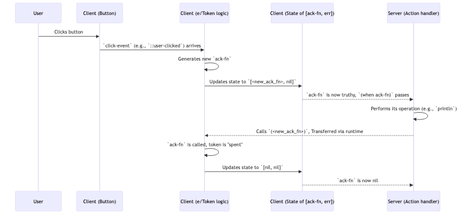

# Chapter 7: Tokens

In [Chapter 6: Mount Points & Tags](06_mount_points___tags_.md), we explored how Electric manages dynamic collections of UI elements efficiently. Now, we'll shift our focus to managing the lifecycle and state of asynchronous operations, particularly those initiated by user interactions like form submissions or button clicks that require server communication. This is where **Tokens** come into play.

## The Challenge: Managing Asynchronous Actions

Imagine you have a button in your application. When a user clicks it, you want to perform an action on the server, like saving data or sending a notification. This is an asynchronous operation: the client tells the server to do something, and then it waits for a response.

Several questions arise:
*   What if the user clicks the button multiple times quickly? Should we send multiple requests?
*   How does the client know if the server action was successful or if an error occurred?
*   How can we disable the button or show a "loading" state while the operation is in progress?

Tokens provide a robust mechanism to handle these scenarios gracefully.

**Think of a token like a numbered ticket you get at a service counter:**
1.  **Requesting Service (User Action)**: You press a button to get a ticket (user clicks a UI element). This ticket (token) represents your request.
2.  **Waiting for Your Turn (Pending State)**: Your ticket number is "active" or "pending." You're waiting for your number to be called.
3.  **Being Served (Action Execution)**: The server processes your request.
4.  **Service Complete (Acknowledgement)**:
    *   **Success**: Your request is fulfilled. Your ticket is marked "served" and is no longer active.
    *   **Error**: There was an issue with your request. Your ticket might be marked "error," and you're informed of the problem. It's no longer active for that attempt.

This "ticket" system ensures that your request is tracked, its status is known, and operations happen correctly, even with delays or multiple users.

## Using `e/Token` for Basic Actions

The primary way to create and use tokens in Electric is with the `(e/Token event-source)` macro. Let's build a simple example: a button that, when clicked, tells the server to log a message.

```clojure
(ns user-main
  (:require [hyperfiddle.electric :as e]
            [hyperfiddle.electric-dom3 :as dom]))

(e/defn TokenDemo []
  (e/client
    (dom/div
      (let [;; 1. Capture click events from the button
            click-event (dom/button
                          (dom/on "click" (e/fn [_] ::user-clicked)) ; Event payload
                          (dom/text "Log Message on Server"))

            ;; 2. Create a token based on click events
            [ack-fn error-details] (e/Token click-event)]

        ;; 3. Display any error details
        (when error-details
          (dom/p (dom/props {:style {:color "red"}})
                 (dom/text "Error: " (str error-details))))

        ;; 4. Perform server action when token is active
        (e/server
          (when ack-fn ; ack-fn is truthy when the token is "active" / "pending"
            (println "Server: Received request, logging message...")
            ;; Simulate some work
            (Thread/sleep 1000)
            ;; Acknowledge the token (operation successful)
            (ack-fn) ; Call with no args for success
            (println "Server: Message logged and token acknowledged.")))))))
```

Let's break this down:
1.  **Capturing the Event**:
    *   `(dom/button ...)` defines our button.
    *   `(dom/on "click" (e/fn [_] ::user-clicked))` sets up an event listener. When clicked, it produces the value `::user-clicked`. This value becomes the `click-event`.

2.  **Creating the Token**:
    *   `[ack-fn error-details] (e/Token click-event)`: This is the core.
        *   `e/Token` takes an `event-source` (our `click-event`).
        *   It returns a pair: `[ack-fn error-details]`.
        *   `ack-fn`: This is the "acknowledgement function." It will be a truthy function object when a new `click-event` arrives and the token becomes "active" or "pending." It will be `nil` otherwise (or after it's acknowledged).
        *   `error-details`: This will contain any error information if `ack-fn` is called with an argument.

3.  **Displaying Errors**:
    *   If `error-details` is not `nil`, we display it.

4.  **Server Action**:
    *   `(e/server ...)`: This block runs on the server.
    *   `(when ack-fn ...)`: The server logic only runs if `ack-fn` is truthy, meaning a token is active due to a recent click. This prevents running the action multiple times for a single click or when no click has happened.
    *   `(ack-fn)`: After the server-side work is done, we call `ack-fn` with no arguments. This "spends" or "acknowledges" the token, signaling success. `ack-fn` on the client will then become `nil` again (until the next click).
    *   If the server operation had failed, we could call `(ack-fn "Something went wrong!")`. This would populate `error-details` on the client.

**What happens when you click the button?**
1.  `click-event` becomes `::user-clicked`.
2.  `(e/Token click-event)` activates. `ack-fn` becomes a function, `error-details` is `nil`.
3.  The `(e/server ...)` block sees `ack-fn` is truthy.
4.  "Server: Received request, logging message..." is printed on the server.
5.  After 1 second, `(ack-fn)` is called on the server.
6.  This signal propagates back. On the client, `ack-fn` (in the `e/Token`'s state) becomes `nil` again.
7.  "Server: Message logged and token acknowledged." is printed.

If you click the button again, the cycle repeats. If you click rapidly, the `(when ack-fn ...)` guard ensures the server logic for a previous click isn't interrupted or duplicated if it's designed to only handle one token at a time (as in this simple example). More sophisticated patterns can handle queuing or cancellation if needed.

This pattern is fundamental to how [Forms (electric-forms5)](05_forms__electric_forms5_.md) manage submissions.

## Under the Hood: The Token Lifecycle

Let's trace the lifecycle managed by `e/Token`:



**Code Glimpse (`hyperfiddle.electric3.cljc`):**

The `(e/Token event-source)` macro is defined in `hyperfiddle.electric3.cljc`. Conceptually, it works like this:
```clojure
;; Simplified conceptual logic for e/Token
(defn Token [event-source & [on?]] ; on? is a predicate, defaults to some?
  (let [!token-state (atom [nil nil])] ; Stores [current-ack-fn, error-details]
    (when (if on? (on? event-source) (some? event-source)) ; When a new event arrives
      (let [[active-ack-fn previous-error] @!token-state]
        (if previous-error ; If previous attempt had an error, allow retry
          (compare-and-set! !token-state
            [nil previous-error] ; Expected old state
            [(fn ack [& [err]] (reset! !token-state [nil err])) nil]) ; New state
          (compare-and-set! !token-state
            [nil nil] ; Expected old state (no active token, no error)
            [(fn ack [& [err]] (reset! !token-state [nil err])) nil])))) ; New state
    (watch !token-state))) ; Return the watched state
```
1.  It maintains an internal atom `!token-state` holding `[ack-fn error-details]`.
2.  When a new `event-source` value arrives (and satisfies the `on?` predicate):
    *   It checks if the current `!token-state` is "idle" (`[nil nil]`) or "error" (`[nil <some-error>]`).
    *   If so, it creates a new acknowledgement function. This function, when called, will `reset!` the `!token-state` back to `[nil <error-if-any>]`.
    *   It updates `!token-state` to `[<new-ack-fn> nil]`.
3.  It returns `(watch !token-state)`, so your code reactively sees changes to `[ack-fn error-details]`.

The actual `TokenImpl` record (also in `electric3.cljc`) is a more general way to create tokens, especially for composing them:
```clojure
(defrecord TokenImpl [name children] ...) ; Implements IFn for acknowledgement

(defn ->Token [name & children]
  (with-meta (->TokenImpl name children) {...}))
```
`electric-forms5` uses `(e/->Token ...)` to chain multiple pending edits into a single, more complex transaction. When the top-level token is acknowledged, it propagates the acknowledgement to its children.

## Token Variations: `CyclicToken` and `StampedToken`

Besides the basic `e/Token`, `electric` (via `hyperfiddle.token_zoo0.cljc`) offers specialized tokens:

*   **`CyclicToken`**: Useful for scenarios like debouncing or handling rapid updates where only the latest action matters. It provides a fresh token for each new qualifying event, effectively cancelling/ignoring previous unacknowledged tokens for the same source.
    *   _Analogy_: Imagine a "take a new ticket" machine that automatically invalidates your old ticket if you take a new one before the old one is served.
    *   Use case: A search input that triggers a server query as the user types. You only care about querying for the latest typed text.

*   **`StampedToken`**: This token carries a value (the "stamp") along with the acknowledgement function. This is useful when the action depends on a specific value that might change.
    *   _Analogy_: Your service ticket not only has a number but also notes the specific item you want (e.g., "Ticket #101 for 'Blue Paint'"). If you change your mind to "Red Paint" and get a new ticket, the old "Blue Paint" ticket might be handled differently or discarded.
    *   `StampedToken` returns `[value ack-fn]`. `value` is the event payload that triggered the token.
    *   Use case: An "upvote" button where the token needs to know which item ID to upvote.

Here's a quick look at how you might use `StampedToken`:
```clojure
;; In your e/defn component (client-side)
(let [item-id-to-process (dom/button ... (dom/on "click" (e/fn [_] "item-abc")))
      ;; StampedToken returns [value ack-fn]
      [item-val ack-fn] (e/StampedToken item-id-to-process)]

  (e/server
    (when ack-fn ; Token is active
      (println "Server: Processing item" item-val) ; item-val is "item-abc"
      ;; ... do work with item-val ...
      (ack-fn)))) ; Acknowledge
```
When the button is clicked, `item-val` will be `"item-abc"`, and `ack-fn` will be active. The server can then use `item-val`.

## Conclusion

Tokens are a powerful concept in Electric for managing the state and lifecycle of asynchronous operations. They provide a clear pattern for:
*   Representing an ongoing action.
*   Tracking its state (pending, error, success).
*   Ensuring operations are handled correctly, especially with user interactions that trigger server communication.
*   Preventing duplicate requests and providing user feedback.

The basic `(e/Token event-source)` is your go-to for many common scenarios, while `CyclicToken` and `StampedToken` offer specialized behaviors for more complex use cases like debouncing or tracking values with acknowledgement. Understanding tokens is key to building robust and responsive interactive features.

With tokens managing individual operations, we also need to consider the overall connection state between the client and server. In the next chapter, we'll look at the [Client Connection](08_client_connection_.md) and how Electric establishes and maintains it.

---

Generated by [AI Codebase Knowledge Builder](https://github.com/The-Pocket/Tutorial-Codebase-Knowledge)