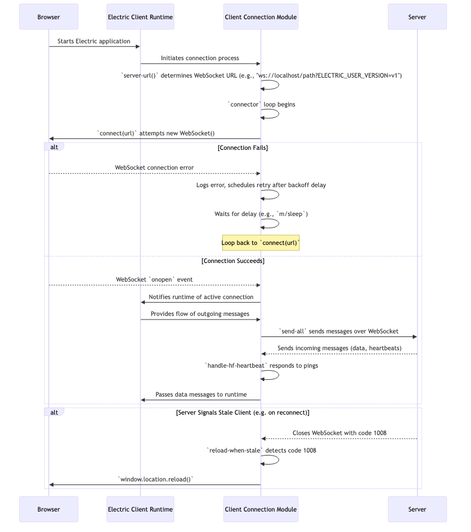

# Chapter 8: Client Connection

In [Chapter 7: Tokens](07_tokens_.md), we saw how Electric manages asynchronous operations like button clicks that trigger server-side actions. Tokens help track the state of these individual requests. But what about the underlying communication channel itself? How does your Electric application in the browser establish and maintain its vital link to the server? This chapter dives into the `Client Connection` module, the browser's dedicated communication agent.

## The Lifeline: Why Client Connection Matters

Imagine you're using an Electric-powered collaborative editor. Your internet connection flickers for a moment. Without a robust client connection mechanism:
*   The application might simply freeze or show an error.
*   You might lose unsaved changes.
*   You'd likely have to manually refresh the page once your internet is back.

The `Client Connection` module in Electric is designed to prevent this. It's responsible for:
1.  Figuring out the server's WebSocket address.
2.  Establishing the initial WebSocket connection.
3.  Sending data from the client to the server.
4.  Receiving messages (including data updates and heartbeats) from the server.
5.  Gracefully handling network interruptions by attempting to reconnect.
6.  Detecting if the client version has become "stale" (e.g., if the server has been updated with breaking changes).

Think of it as a tenacious messenger assigned to keep a phone line open between your browser and the Electric server, redialing patiently if the line drops, and checking if they have the latest instructions. You, as an Electric application developer, usually don't interact with this module directly; it works tirelessly behind the scenes, managed by the [Electric Runtime](03_electric_runtime_.md).

## Key Responsibilities of the Client's Communication Agent

Let's look at the main tasks handled by this module, which primarily lives in `hyperfiddle.electric_client3.cljs`.

1.  **WebSocket URL Construction**:
    The client needs to know where to connect. The `server-url` function intelligently constructs the WebSocket URL (e.g., `ws://localhost:8080` or `wss://myapp.com`) from the browser's current HTTP/HTTPS URL. It also appends a client version identifier.

2.  **Connecting**:
    The `connect` function attempts to establish a WebSocket connection to the derived URL.

3.  **Handling Messages & Heartbeats**:
    Once connected, the client listens for messages. A special `handle-hf-heartbeat` function responds to server "HEARTBEAT" messages by sending one back, ensuring both sides know the connection is alive. Other messages are passed to the [Electric Runtime](03_electric_runtime_.md).

4.  **Sending Data**:
    When your `e/server` blocks need to send data or invoke functions, the client runtime uses functions like `send-all` to transmit these messages over the WebSocket.

5.  **Reconnection with Exponential Backoff**:
    If the connection drops or fails to establish, the `connector` logic kicks in. It doesn't just give up. It retries, but with increasing delays between attempts (e.g., 1s, 1s, 2s, 3s, 5s...). This is "exponential backoff," preventing the client from flooding the server with connection requests. The delays are derived from a Fibonacci sequence.

6.  **Detecting Stale Clients**:
    If the server application has been updated while a client was connected or attempting to reconnect, the client's code might be incompatible. The server can signal this by closing the WebSocket connection with a specific code (1008). The `reload-when-stale` mechanism detects this and automatically reloads the browser page to fetch the new client assets.

## How it Works: A Day in the Life of the Connection

You typically don't *call* these functions directly. The Electric client runtime orchestrates them. Here's a simplified sequence of what happens when your Electric application loads in the browser:



## A Glimpse Under the Hood: Code Snippets

Let's peek at some key functions from `hyperfiddle.electric_client3.cljs`.

**1. Constructing the Server URL:**
The `server-url` function figures out the WebSocket endpoint.

```clojurescript
;; From: src/hyperfiddle/electric_client3.cljs
(defn server-url []
  (let [url (new js/URL (.-location js/window)) ; Get current browser URL
        proto (.-protocol url)]
    (set! (.-protocol url)
      (case proto ; Change http to ws, https to wss
        "http:" "ws:"
        "https:" "wss:"
        (throw (ex-info "Unexpected protocol" proto))))
    ;; Add client version for cache-busting and stale detection
    (.. url -searchParams (set "ELECTRIC_USER_VERSION" ELECTRIC_USER_VERSION))
    (set! (.-hash url) "") ; Remove fragment
    (.toString url)))
```
This takes the page's URL, like `http://example.com/app`, and transforms it into `ws://example.com/app?ELECTRIC_USER_VERSION=...`.

**2. Basic Connection Attempt:**
The `connect` function is a Missionary task that tries to open a WebSocket.

```clojurescript
;; From: src/hyperfiddle/electric_client3.cljs
(defn connect [url]
  (fn [s f] ; Missionary subscriber function (success, fail)
    (try
      (let [ws (new js/WebSocket url)]
        (set! (.-binaryType ws) "arraybuffer") ; Electric uses binary messages
        (set! (.-onopen ws) (fn [_] (remove-listeners ws) (s ws))) ; Success
        (set! (.-onclose ws) (fn [_] (remove-listeners ws) (s nil))) ; End/Close
        #(when (= (.-CONNECTING js/WebSocket) (.-readyState ws))
           (.close ws))) ; Cleanup: close if still connecting on cancel
      (catch :default e (f e) #())))) ; Failure
```
This sets up handlers for when the connection opens (`onopen`) or closes (`onclose`).

**3. The Reconnection Maestro: `connector`**
The `connector` function is the heart of the resilient connection logic. It's a complex Missionary flow.

```clojurescript
;; Simplified concept of the connector loop
;; From: src/hyperfiddle/electric_client3.cljs
(defn connector [url]
  (let [state (object-array 1)] ; Holds the active WebSocket
    [(fn [cb] ; on-message callback setup
       (let [ws (aget state 0)]
         (set! (.-onmessage ws) (comp (handle-hf-heartbeat ws cb) payload))
         #(set! (.-onmessage ws) nil)))
     (fn [events] ; Flow of outgoing messages
       (m/sp ; Missionary sequential process
         (loop [delays retry-delays] ; `retry-delays` is like [1000, 1000, 2000, ...]
           (.log js/console "Connecting...")
           (if-some [ws (m/? (connect url))] ; Attempt to connect
             (do (aset state 0 ws) ; Store active WebSocket
                 (m/? (send-all ws events)) ; Send outgoing messages
                 ;; ... handle close, check close code ...
                 (when (should-retry? close-code) (recur (next delays))))
             (do (.log js/console "Failed. Next attempt in...")
                 (m/? (m/sleep (first delays) (next delays))) ; Wait
                 (recur (next delays)))))))]))
```
This loop tries to `connect`. If it succeeds, it uses `send-all` to manage message passing. If the connection drops or fails, it waits for a duration from `retry-delays` and then tries again. `should-retry?` (not shown) checks the WebSocket close code to decide if retrying is appropriate.

**4. Exponential Backoff Delays:**
The `retry-delays` are generated from a Fibonacci sequence to implement exponential backoff.

```clojurescript
;; From: src/hyperfiddle/electric_client3.cljs
(defn fib-iter [[a b]] (case b 0 [1 1] [b (+ a b)]))
(def fib (map first (iterate fib-iter [1 1]))) ; (1 1 2 3 5 8 ...)
(def retry-delays (map (partial * 1000) (next fib))) ; (1000 1000 2000 3000 ...) ms
```
This ensures that repeated connection failures lead to progressively longer waits before retrying.

**5. Handling Stale Clients:**
The `reload-when-stale` function wraps the main client task. If an error occurs and is identified as `::stale-client` (typically due to WebSocket close code 1008), it reloads the page.

```clojurescript
;; From: src/hyperfiddle/electric_client3.cljs
(defn reload-when-stale [task]
  (fn [s f] ; Missionary subscriber
    (task s (fn [error] ; Original error handler
              (when (= ::stale-client (:hyperfiddle.electric/type (ex-data error)))
                (.log js/console "Stale client detected. Refreshing.")
                (.reload (.-location js/window))) ; Reload the page!
              (f error))))) ; Pass on other errors
```
This ensures the user gets the latest version of the client-side application code if the server indicates the current one is outdated.

## Analogy: The Persistent Messenger

Think of the `Client Connection` module as a very persistent messenger for your browser:
*   **Finding the Address (`server-url`)**: The messenger first looks up the Head Office's (Server's) exact address and department (WebSocket endpoint and version).
*   **Making the Call (`connect`)**: The messenger tries to establish a phone line.
*   **Line Busy/Dropped (`connector` retries)**: If the line is busy or drops, the messenger doesn't give up. They wait a bit (1 second), try again. Still no? Wait a bit longer (another 1 second), try again. Still no? Wait even longer (2 seconds)... This is exponential backoff.
*   **"Is Anyone There?" (`handle-hf-heartbeat`)**: Periodically, the Head Office says "ping," and the messenger must reply "pong" to show they're still on the line and attentive.
*   **Outdated Instructions (`reload-when-stale`)**: If the Head Office tells the messenger, "Your instruction manual is outdated (code 1008); you need to come back for a new one," the messenger immediately returns to base (reloads the page) to get the latest manual.

This tireless effort ensures the communication line stays as open and up-to-date as possible.

## Conclusion

The Client Connection module is a critical, albeit background, component of Electric. It provides the resilience and reliability needed for modern web applications by robustly managing the WebSocket connection lifecycle. It handles URL construction, initial connection, message exchange, heartbeats, intelligent reconnection strategies with exponential backoff, and even self-correction through page reloads when a client version becomes stale. While you don't typically write code *for* this module, understanding its operation helps appreciate the stability of your Electric applications.

This module handles the client side of the WebSocket. But what about the server? How does it accept and manage these WebSocket connections? That's the topic of our next chapter: [Chapter 9: Websocket Adapters](09_websocket_adapters_.md).

---

Generated by [AI Codebase Knowledge Builder](https://github.com/The-Pocket/Tutorial-Codebase-Knowledge)