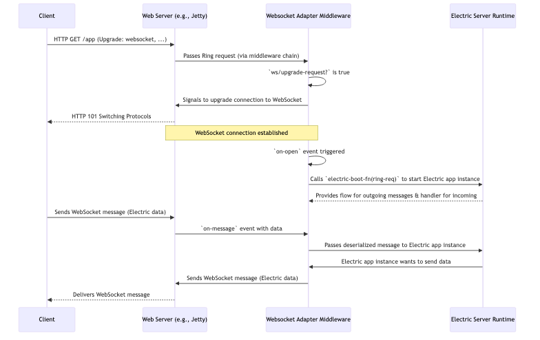

# Chapter 9: Websocket Adapters

In [Chapter 8: Client Connection](08_client_connection_.md), we explored how the client-side of your Electric application tenaciously maintains its WebSocket connection to the server. But how does the server accept these connections and speak Electric's language over WebSockets? That's where **Websocket Adapters** come in. They are the server's specialized "ports" designed to welcome and communicate with Electric clients.

## Plugging Electric into Your Web Server

Imagine you have a powerful Electric application, but it needs to run within an existing web server environment, perhaps one built with Jetty, HTTPKit, or another standard Clojure web server library. Your web server knows how to handle regular HTTP requests, but Electric's real-time magic happens over WebSockets.

**Websocket Adapters** are components that bridge Electric's runtime with these specific web server libraries. They act like a universal adapter plug, allowing the Electric server engine (your "device") to connect to different "power outlets" (web servers).

These adapters are crucial because different web servers have their own APIs for handling WebSockets. An adapter provides a standardized way for Electric to:
*   Recognize and accept incoming WebSocket upgrade requests.
*   Manage the lifecycle of each server-side WebSocket connection (`on-open`, `on-message`, `on-close`, `on-error`).
*   Handle message serialization (from Electric's internal format to what goes on the wire) and deserialization (from the wire into what Electric's runtime understands).
*   Manage pings/pongs for keepalive mechanisms and connection timeouts from the server's perspective.
*   Translate between the specific web server's WebSocket API and Electric's internal communication protocol.

Most importantly, they leverage the standard **Ring interface** where possible, making integration into existing Clojure web applications smoother.

## How Do You Use Them? (Server Setup)

You typically encounter Websocket Adapters during your server setup. They are often configured as Ring middleware. The goal is to tell your web server: "If an HTTP request wants to upgrade to a WebSocket for Electric, let this adapter handle it."

Here's a conceptual example of how you might add an Electric WebSocket adapter to your Ring handler stack:

```clojure
(require '[your-web-server :as web-server]
         '[hyperfiddle.electric-ring-adapter3 :as electric-adapter]
         '[my-app.electric-main :as app]) ; Your Electric entrypoint

;; 1. Your main Electric application entry e/defn
;;    (e.g., defined in my-app.electric-main)
;;    (e/defn Main [ring-req] (e/client ...))

;; 2. A boot function that starts Electric for a given request
(defn electric-boot-fn [ring-req]
  ;; hyperfiddle.electric/boot-server is often used here
  (hyperfiddle.electric/boot-server {} app/Main ring-req))

;; 3. Your regular HTTP handler
(defn http-handler [request]
  {:status 200, :headers {"Content-Type" "text/html"}, :body "Hello HTTP!"})

;; 4. Combine with the Electric adapter
(def app-handler
  (electric-adapter/wrap-electric-websocket http-handler electric-boot-fn))

;; 5. Start your server
;; (web-server/run-server app-handler {:port 8080})
```

Let's break this down:
1.  `app/Main`: This is assumed to be your main `e/defn` that boots your Electric application.
2.  `electric-boot-fn`: This function is crucial. When a new WebSocket connection is established, the adapter will call this function, passing the initial Ring request. This function's job is to start up an instance of your Electric application for *that specific client connection*. It usually involves `hyperfiddle.electric/boot-server` or a similar mechanism.
3.  `http-handler`: Your standard Ring handler for non-WebSocket HTTP requests.
4.  `electric-adapter/wrap-electric-websocket`: This is the star. It's a Ring middleware.
    *   It takes your `http-handler` (for requests that aren't WebSocket upgrades) and the `electric-boot-fn`.
    *   It inspects incoming requests. If a request is a WebSocket upgrade (indicated by headers like `Upgrade: websocket`), this middleware "hijacks" it and hands it over to Electric's WebSocket handling logic. Otherwise, it passes the request to `http-handler`.

When a client attempts to connect via WebSocket (as discussed in [Chapter 8: Client Connection](08_client_connection_.md)), this server-side adapter is ready to receive it, establish the WebSocket, and then use `electric-boot-fn` to spin up the server-side part of your Electric application for that client.

## Under the Hood: The Handshake and Beyond

Let's trace what happens when a client tries to establish an Electric WebSocket connection with a server using such an adapter.



**Core Logic in `hyperfiddle.electric-ring-adapter3.clj`**

This file provides a generic Ring 1.11+ compliant adapter. Specific adapters for servers like Jetty (`hyperfiddle.electric-jetty9-ring-adapter.clj`) or HTTPKit (`hyperfiddle.electric-httpkit-adapter3.clj`) either build upon it, or implement similar logic tailored to their server's API.

1.  **`wrap-electric-websocket` Middleware**:
    This is the main entry point you add to your Ring stack.

    ```clojure
    ;; From: src/hyperfiddle/electric_ring_adapter3.clj
    (defn wrap-electric-websocket [next-handler entrypoint-boot-fn]
      (fn [ring-request]
        (if (ws/upgrade-request? ring-request) ; Is it a WebSocket upgrade?
          (ring-ws-handler ring-request entrypoint-boot-fn) ; Yes, handle it
          (next-handler ring-request)))) ; No, pass to next HTTP handler
    ```
    It checks if the request is asking to switch protocols to WebSocket using `ring.websocket/upgrade-request?`.

2.  **`ring-ws-handler` and `electric-ws-handler`**:
    If it's a WebSocket upgrade, `ring-ws-handler` is called. It prepares a map of listener functions (`:on-open`, `:on-message`, etc.) that the underlying Ring WebSocket implementation will use. `electric-ws-handler` generates these.

    ```clojure
    ;; Conceptual structure from electric_ring_adapter3.clj
    (defn electric-ws-handler [ring-req boot-fn]
      (let [state (object-array 2) ; To store runtime's message/close handlers
            on-message-slot (int 0)
            keepalive-mailbox (m/mbx)] ; For timeout tracking
        {:on-open (fn on-open [socket]
                    ;; ...
                    ;; THIS IS KEY: Start Electric server for this client
                    (write-msgs socket ((boot-fn ring-req) ; Call user's boot fn
                                         (r/subject-at state on-message-slot))) 
                    ;; ... also start heartbeat and timeout flows ...
                    )
         :on-message (fn on-message [_socket msg-payload]
                       (keepalive-mailbox nil) ; Reset timeout
                       (when-not (= "HEARTBEAT" msg-payload) ; Ignore client heartbeats
                         ((aget state on-message-slot) msg-payload))) ; Pass to runtime
         ;; ... :on-close, :on-error, :on-ping, :on-pong handlers ...
         }))
    ```
    *   **`:on-open`**: When the WebSocket is established, this is called. Critically, it executes `(boot-fn ring-req)`. The result of `boot-fn` is expected to be an Electric runtime flow. `(r/subject-at state on-message-slot)` provides a way for the adapter to feed incoming messages *into* this specific client's Electric runtime instance. `write-msgs` sets up sending messages *from* the runtime out via the socket.
    *   **`:on-message`**: When a message arrives from the client, it's passed to the handler stored in `(aget state on-message-slot)`, which is the input channel for this client's [Electric Runtime](03_electric_runtime_.md).
    *   **Keepalives**: The adapter also manages server-side heartbeats (`send-hf-heartbeat`) and connection timeouts (`timeout`) to ensure connections don't stay open indefinitely if the client disappears without a clean close. `ELECTRIC_CONNECTION_TIMEOUT` and `ELECTRIC_HEARTBEAT_INTERVAL` control these.

3.  **Sending Messages (`write-msgs`)**:
    The [Electric Runtime](03_electric_runtime_.md) produces a flow of messages destined for the client. `write-msgs` consumes this flow and sends each message over the WebSocket.

    ```clojure
    ;; Conceptual structure of write-msgs from electric_ring_adapter3.clj
    (defn write-msgs [socket msgs-flow]
      (fn [success-cb error-cb] ; Missionary task
        ;; ... complex logic using an AtomicInteger state ...
        ;; For each message from msgs-flow:
        ;;   (send socket message 
        ;;         (fn ack [] (when (ready-for-next?) (request-next-msg)))
        ;;         (fn crash [e] (error-cb e)))
        ;; ...
        )))
    ```
    This ensures messages are written sequentially and handles backpressure.

**Specific Adapters (e.g., Jetty, HTTPKit)**:
Libraries like `hyperfiddle.electric-jetty9-ring-adapter` or `hyperfiddle.electric-httpkit-adapter3` provide the glue for specific servers:
*   They might use `electric_ring_adapter3.clj` as a foundation if the server has good Ring WebSocket support.
*   Or, they might implement the same *logic* (handling `on-open`, `on-message`, etc., and interfacing with `boot-fn`) but using the server's native WebSocket API directly.
*   For example, `electric_jetty9_ring_adapter.clj` creates a Jetty `WebSocketAdapter` and maps its lifecycle methods (`onWebSocketConnect`, `onWebSocketText`, etc.) to the patterns seen in `electric-ws-handler`. The `HTTPKitSocket` record in the HTTPKit adapter does a similar translation for HTTPKit's `AsyncChannel`.

These adapters effectively "speak" the native WebSocket dialect of their target server on one side, and Electric's generic needs on the other.

## The Universal Adapter Analogy Revisited

Think of your Electric application server as a sophisticated electronic device you want to use in different countries.
*   **Electric Runtime**: Your device (e.g., a laptop).
*   **Web Servers (Jetty, HTTPKit, etc.)**: Different countries' power outlets (UK, US, EU styles). Each has a unique socket shape and voltage.
*   **Websocket Adapters**: These are the travel adapter plugs.
    *   A "Jetty Adapter" fits perfectly into a Jetty "outlet."
    *   An "HTTPKit Adapter" fits an HTTPKit "outlet."
*   **Ring Interface**: A standard design principle for these adapters, making them somewhat interchangeable or at least conceptually similar.

No matter which "country" (web server) you're in, the correct adapter lets you plug in your Electric "laptop" and get it running, handling the translation of "power" (WebSocket messages and lifecycle events).

## Conclusion

Websocket Adapters are essential server-side components that allow your Electric applications to integrate with various web server environments. By implementing Ring middleware (like `wrap-electric-websocket`) or server-specific handlers, they manage the server-side WebSocket lifecycle, bridge to the Electric runtime using a `boot-fn`, and handle the intricacies of message passing, keepalives, and timeouts. This abstraction ensures that Electric can "plug into" different server backbones, providing flexibility in how you deploy your reactive applications.

This chapter concludes our core journey through the main concepts of Electric! You've learned about the DSL, reactivity, incremental sequences, the runtime, DOM manipulation, forms, mount points, tokens, client connections, and now, websocket adapters. With these building blocks, you're well-equipped to start building powerful, interactive applications with Electric.

---

Generated by [AI Codebase Knowledge Builder](https://github.com/The-Pocket/Tutorial-Codebase-Knowledge)