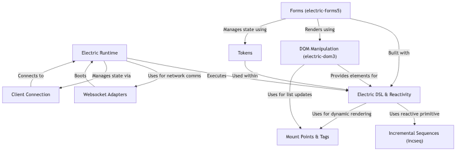

# Tutorial: electric

Electric is a Clojure(Script) framework for building **full-stack web applications** where application state is automatically synchronized between the *server* and *client browser* over WebSockets.
You write code using Electric's special **DSL (`e/defn`, `e/fn`, `e/client`, `e/server`)**, and the Electric **Runtime** manages the reactivity and network communication.
It uses **Incremental Sequences (`incseq`)** to efficiently update data by sending only *diffs* (changes) over the network, making UIs highly responsive.
Includes libraries for **DOM Manipulation** (`electric-dom3`) and building complex **Forms** (`electric-forms5`) that integrate seamlessly with its reactive model.

**Source Repository:** [None](None)

## Chapters

1. [Electric DSL & Reactivity](01_electric_dsl___reactivity_.md)
2. [Incremental Sequences (incseq)](02_incremental_sequences__incseq__.md)
3. [Electric Runtime](03_electric_runtime_.md)
4. [DOM Manipulation (electric-dom3)](04_dom_manipulation__electric_dom3__.md)
5. [Forms (electric-forms5)](05_forms__electric_forms5__.md)
6. [Mount Points & Tags](06_mount_points___tags_.md)
7. [Tokens](07_tokens_.md)
8. [Client Connection](08_client_connection_.md)
9. [Websocket Adapters](09_websocket_adapters_.md)